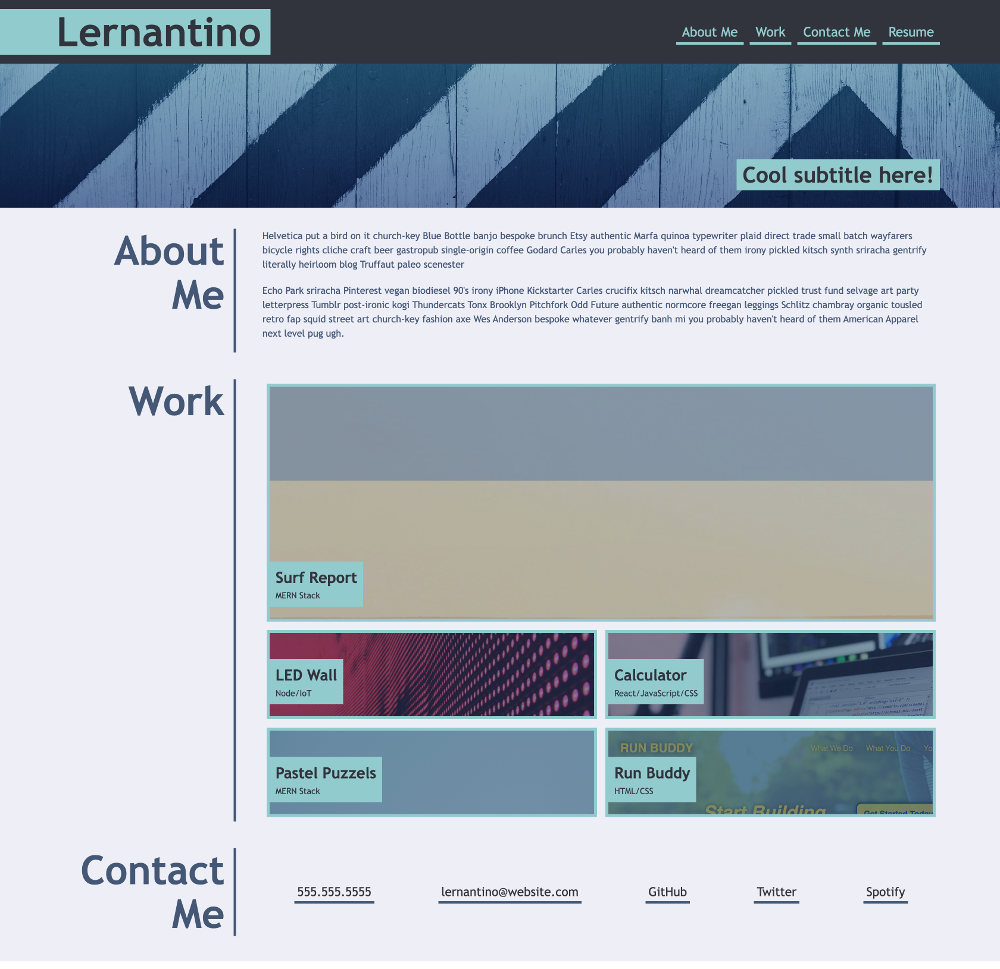

# thannan-personal-portfolio

## About this project
A current portfolio showcasing my skills and talent to employers who are looking to fill part-time and full-time position in Front End Web Development. Using this 

## Screenshot
The following shows the web applications mock up appearance I used to guide my current portfolio:

## Project Link
Application can can be viewed here: 
* [Live](https://tahminahannan.github.io/thannan-personal-portfolio//)

* [Repository](https://github.com/TahminaHannan/thannan-personal-portfolio)

## Built with:
* HTML
* CSS:
Flexbox, CSS variables + Media queries (Smallest Screen size: 0-769px | Next Screen Size: 770px-979px | Largest Screen Size: 980px - ~ )

* Gitbash

## Tests
Tested the website functionality using:
* [w3 - Validator](https://validator.w3.org/nu/)

## Credits
I would like to thank the following resources:
* [Youtube - ](https://www.youtube.com/watch?v=9zBsdzdE4sM)
* [CodePen - ](https://codepen.io/crbecker1/pen/WNwQMdB)
* [CSS Tricks - ](https://css-tricks.com/snippets/css/media-queries-for-standard-devices/)

## License
Distributed under the MIT License. See LICENSE.txt for more information.